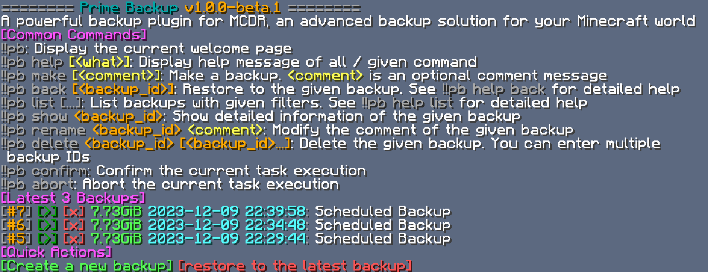

# Prime Backup

**English** | [中文](README.zh.md)

A powerful backup plugin for MCDR, an advanced backup solution for your Minecraft world

Document: https://tisunion.github.io/PrimeBackup/

## Features

- Hash-based, compressed file pool deduplication. Only new or changed data is stored, with no hard limit on backup count
- Optional blob chunking algorithm. Supports CDC (content-defined chunking) for large, locally edited files to improve deduplication across backups
- Safe restore workflow: confirmation + countdown, automatic pre-restore backup, recycle-bin rollback, and data verification
- Comprehensive backup operations, including backup/restore, list/delete, import/export, comments/tags, etc.
- Smooth in-game interaction, with most operations achievable through mouse clicks
- Rich database toolkit: overview statistics, integrity validation, orphan cleanup, file deletion, and hash/compression method migration
- Highly customizable backup pruning strategies, similar to the strategy used by [PBS](https://pbs.proxmox.com/docs/prune-simulator/)
- Scheduled jobs for automatic backup creation and backup pruning, support fixed intervals and crontab expressions
- Provides a command-line tool if you want to manage backups without MCDR. Also supports mounting as a filesystem via FUSE

## Requirements

[MCDReforged](https://github.com/Fallen-Breath/MCDReforged) requirement: `>=2.12.0`

Python package requirements: See [requirements.txt](requirements.txt)

## Usages

See the document: https://tisunion.github.io/PrimeBackup/

## How it works

Prime Backup maintains a custom file pool to store backup data. Every stored object is identified by a hash of its content.
With that, Prime Backup can deduplicate files with the same content, and only stores 1 copy of them, greatly reducing disk usage

Prime Backup also supports compression on stored data to further reduce disk usage

For large and locally edited files, Prime Backup can optionally use CDC (Content-Defined Chunking) for better deduplication.
The file is split into content-defined chunks. Each chunk is hashed and reused across backups when unchanged, only new chunks are stored

Prime Backup stores common file types, including regular files, directories, and symbolic links. For these 3 types:

- Regular file: Prime Backup calculates hashes (and size)
  If CDC is enabled, it stores the file as a chunked blob that references chunks; chunks are deduplicated and compressed individually
  Otherwise, it stores a direct blob; the whole file is deduplicated and compressed as a single unit
  File metadata such as mode, uid, and mtime are stored in the database
- Directory: Prime Backup stores its information in the database
- Symlink: Prime Backup stores the symlink itself instead of the linked target

## Thanks

The idea for the hash-based file pool is inspired by https://github.com/z0z0r4/better_backup
