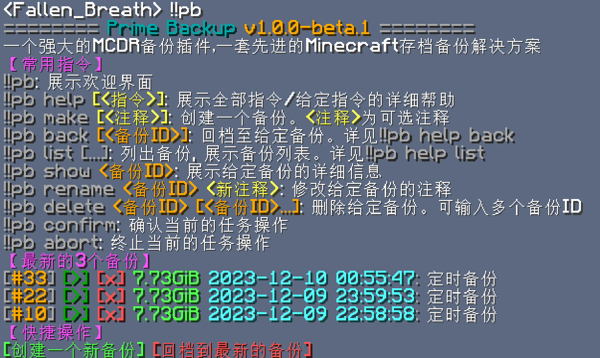

# Prime Backup

[English](README.md) | 中文

一个强大的 MCDR 备份插件，一套先进的 Minecraft 世界备份解决方案

中文文档：https://tisunion.github.io/PrimeBackup/zh/

## 功能特性

- 基于哈希的文件池与压缩去重：仅存储新增或变更的数据，备份数量没有上限
- 可选的文件分块算法：支持使用固定大小分块（Fixed-Size Chunking）、内容定义分块（Content-Defined Chunking）等算法，将文件切分成多个数据块并逐个哈希去重储存，进一步提升去重效果
- 紧凑的数据块存储方案：使用打包文件批量存储数据块文件，有效避免创建大量小文件时对文件系统的压力
- 安全的回档流程：包含确认与倒计时、回档前自动创建备份、回收站式的回滚机制以及数据完整性校验
- 流畅的游戏内交互，大部分操作都能点点点
- 完善的备份操作：包括备份回档、列表查看、差异展示、导入导出等
- 丰富的数据库工具，含对象查询、数据库概览、数据完整性校验、孤儿数据清理、备份文件删除、哈希/压缩算法迁移等功能
- 高度可自定义的备份清理策略，是 [PBS](https://pbs.proxmox.com/docs/prune-simulator/) 所用策略的同款
- 定时任务：支持自动创建备份和自动清理备份，计划方式支持固定间隔和 crontab 表达式
- 支持作为命令行工具使用，无需启动 MCDR 即可管理备份，还可以通过 FUSE 挂载为文件系统进行访问

## 依赖

[MCDReforged](https://github.com/Fallen-Breath/MCDReforged) 依赖：`>=2.12.0`

Python 包要求：见 [requirements.txt](requirements.txt)

## 使用方法

参见文档：https://tisunion.github.io/PrimeBackup/zh/

## 工作原理

Prime Backup 使用一个自定义的文件池来存储备份数据，池中的每个对象都以其内容的哈希值作为唯一标识
通过这种方式，Prime Backup 可以对内容完全相同的文件进行去重，并只存储它们的一份副本，从而显著降低磁盘空间占用

此外，Prime Backup 还支持对存储的数据进行压缩，以进一步减少磁盘使用量

对于体积较大且仅被局部修改的文件，Prime Backup 可选择启用数据分块功能来提升去重效率。
此时，文件会被切分成多个数据块（chunk），每个数据块都会计算哈希值。
如果数据块的内容没有改变，它就可以在不同的备份中被复用，只有新的数据块载荷会作为打包条目写入

Prime Backup 支持常见的文件类型，包括普通文件、目录和符号链接；对于这三类文件：

- 普通文件：Prime Backup 会先计算其哈希值（及文件大小）
  启用分块时，文件以“chunked blob”形式存储，并引用多个数据块；数据块会独立去重，新的数据块载荷会被压缩并存储为打包条目
  否则，文件会以“direct blob”形式存储，整个文件作为一个单元进行去重和压缩
  文件的权限（mode）、用户ID（uid）、修改时间（mtime）等元数据会存储在数据库中
- 目录：Prime Backup 将其信息存储在数据库中
- 符号链接：Prime Backup 存储的是符号链接本身，而不是它所指向的目标文件

## 致谢

基于哈希的文件池思路来自 https://github.com/z0z0r4/better_backup
