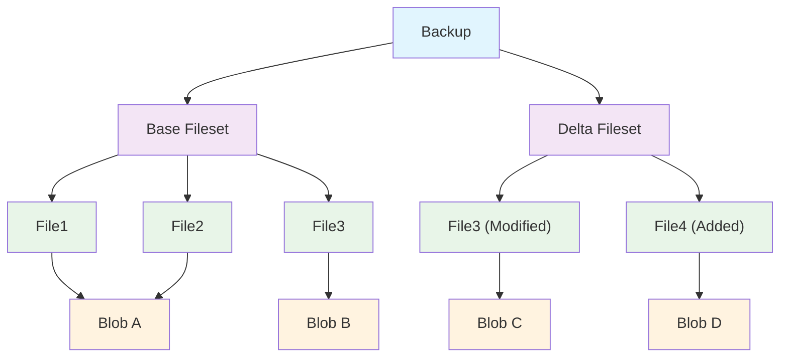
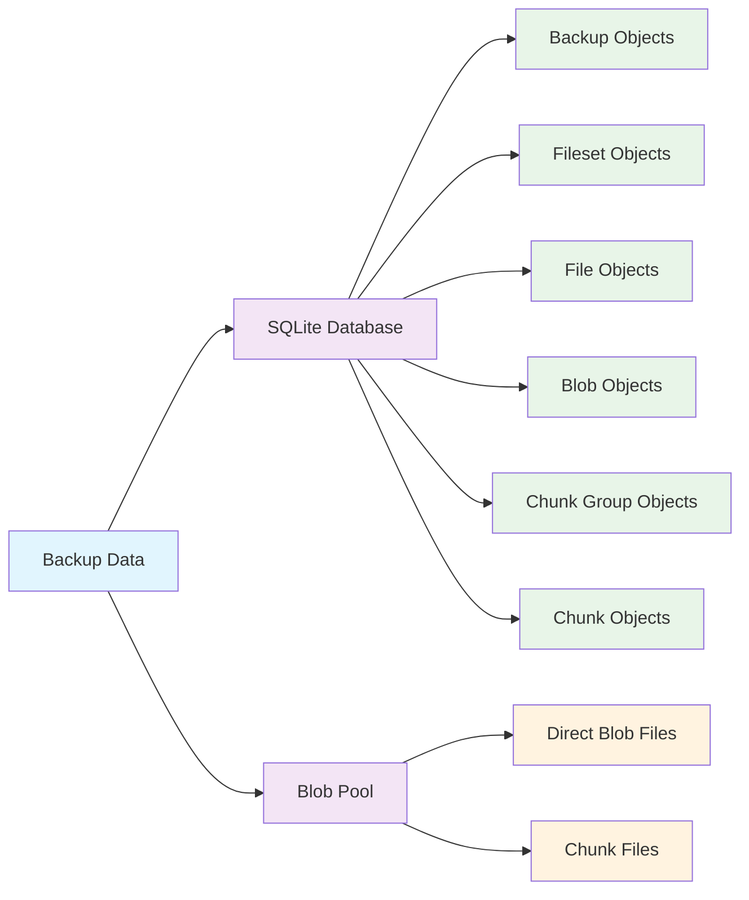

# Storage Structure

## Backup

A backup represents a complete snapshot of the backup target at a specific point in time. Each backup has a unique ID as its identifier

Each backup contains information related to the backup such as creator information, backup notes, backup time, etc.

Each backup is associated with a base fileset and a delta fileset, which together describe the list of files contained in this backup

## Fileset

Fileset is the storage unit of backups, using a combination of base fileset and delta fileset

Base Fileset:

- Contains a complete file list
- Stores file metadata and content references
- Can be referenced by multiple delta filesets

Delta Fileset:

- Only contains changes relative to the base fileset
- Stores information about added, modified, and deleted files
- Depends on the base fileset and does not exist independently

## File

File represents a file item in a backup, containing file metadata and data hash

- Contains the Unix-style path of the file relative to [source_root](config.md#source_root)
- Contains file metadata such as permissions, owner, timestamps, etc.
- For regular files, only stores the hash value of their file content
- For symbolic link files, directly stores the path they point to
- Uses the role field to identify its role in the fileset:
  - Independent file: Complete file in the base fileset
  - Override file: File in the delta fileset that replaces the base file
  - Added file: Newly added file in the delta fileset
  - Delete marker: File that has been deleted in the delta fileset

## Blob

Blob is the actual storage object for file content

- Uses hash value as its unique identifier, one hash value has exactly one corresponding blob
- Only stores file content data and its compression method, does not store actual file metadata
- Has two storage methods: `direct` and `chunked`
  - A direct blob is stored independently as a file in the `blobs` folder under [storage_root](config.md#storage_root)
  - A chunked blob is cut into serval chunks, and the chunks are stored as files in `blobs/_chunks`
- One blob can be referenced by multiple file objects. When the reference count drops to 0, PrimeBackup will delete this blob

## Chunk and Chunk Group

Chunk is the deduplication unit used by CDC chunking for large files

- A chunk stores a piece of file content, its hash, its compression method, and its size information
- Chunks are content-defined, so inserting or modifying data in the middle of a large file can still keep many neighboring chunks reusable
- Chunk files are stored independently and deduplicated globally, just like direct blobs

Chunk group is an ordered list of chunks used to reduce metadata fan-out for a chunked blob

- Prime Backup groups consecutive chunks into chunk groups, then binds chunk groups back to the blob in order
- Reconstructing a chunked blob means reading its chunk groups in order and then reading the chunks inside each group in order
- For a chunked blob, the blob `stored_size` is the sum of unique stored chunk sizes instead of the size of one standalone blob file

## Storage Architecture Diagram

