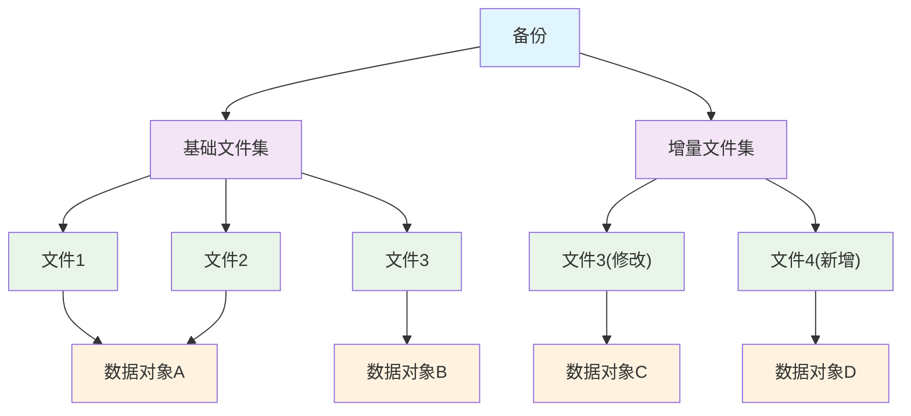
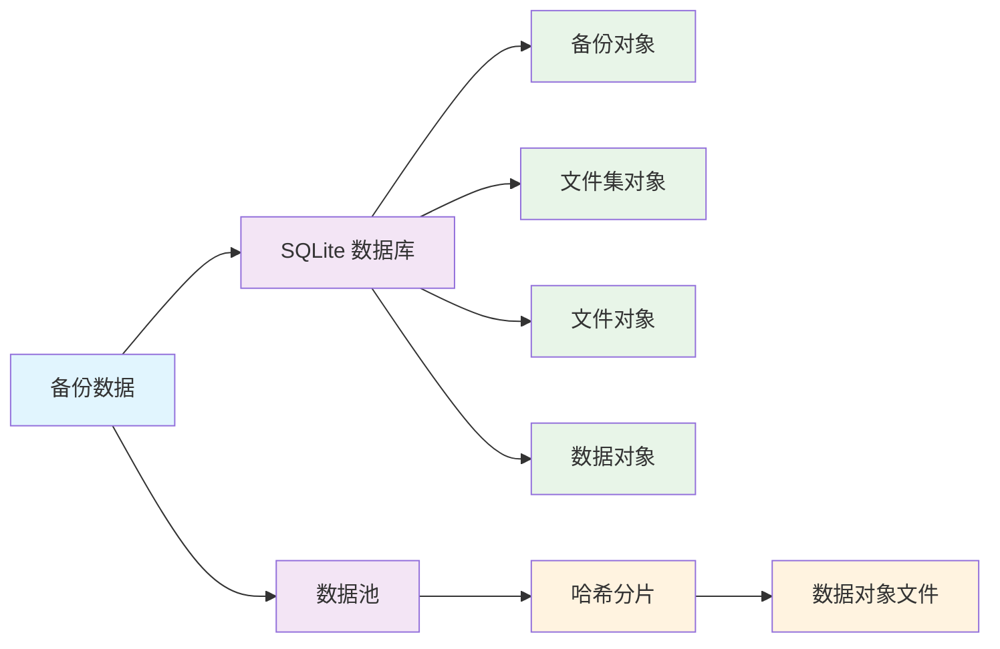

# 存储结构

## 备份（Backup）

一个备份代表在特定时间点对备份目标的完整快照。每个备份都有唯一的 ID 作为其标识符

每个备份包含创建者信息、备份注释、备份时间等与备份相关的信息

每个备份都关联一个基础文件集和一个增量文件集，它们两个共同描述了这个备份所含的文件列表

## 文件集（Fileset）

文件集是备份的存储单元，采用基础文件集和增量文件集的组合模式

基础文件集（Base Fileset）：

- 包含一个完整的文件列表
- 存储文件的元数据和内容引用
- 可以被多个增量文件集引用

增量文件集（Delta Fileset）：

- 仅包含相对于基础文件集的变更
- 存储新增、修改、删除的文件信息
- 依赖基础文件集，不会独立存在

## 文件（File）

文件代表备份中的一个文件项，包含文件元数据和数据哈希

- 包含文件相对 [source_root](config.zh.md#source_root) 的 unix 风格路径
- 包含权限、所有者、时间戳等文件元信息
- 对于普通文件，仅储存其文件内容的哈希值
- 对于符号链接文件，直接储存其指向的路径
- 使用 role 字段标识其在文件集中的角色：
  - 独立文件：基础文件集中的完整文件
  - 覆盖文件：增量文件集中替换基础文件的文件
  - 新增文件：增量文件集中新增的文件
  - 删除标记：增量文件集中被删除的文件

## 数据对象（Blob）

数据对象（Blob）是实际的文件内容的实际储存对象

- 使用哈希值作为其唯一标识符，一个哈希值有且仅有一个对应的数据对象
- 只储存文件的内容数据及其压缩方式，不储存实际文件的元信息
- 以文件形式独立存储，位于 [storage_root](config.zh.md#storage_root) 路径下的 blobs 文件夹
- 一个数据对象可被多个文件对象引用。当引用数下降为 0 时，PrimeBackup 会删除这一数据对象

## 存储架构图

