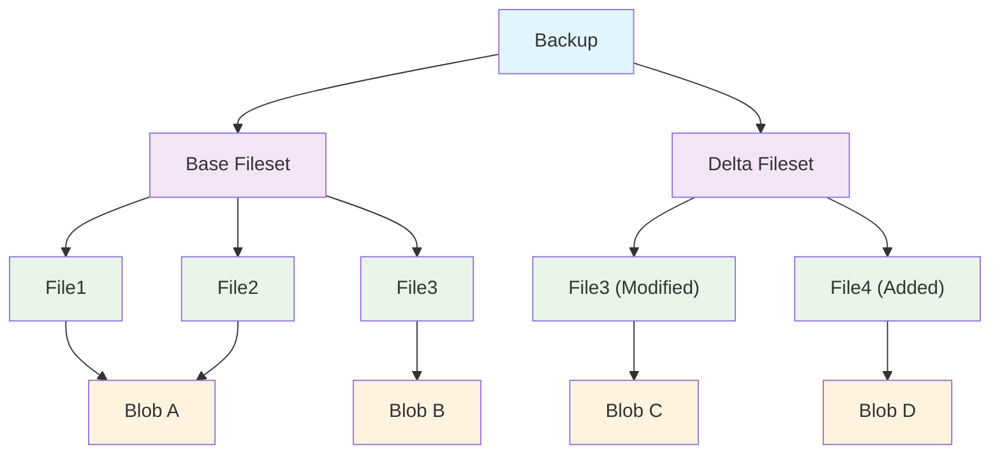
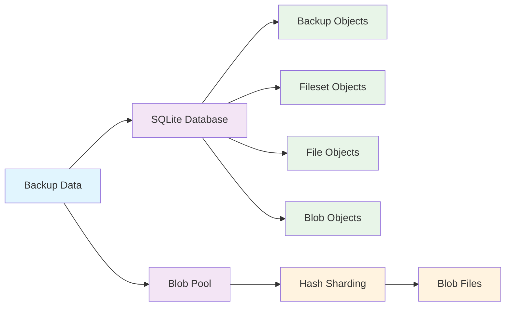

# PrimeBackup Core Concepts

This document introduces the core concepts of PrimeBackup

## Storage Structure

### Backup

A backup represents a complete snapshot of the backup target at a specific point in time. Each backup has a unique ID as its identifier

Each backup contains information related to the backup such as creator information, backup notes, backup time, etc.

Each backup is associated with a base fileset and a delta fileset, which together describe the list of files contained in this backup

### Fileset

Fileset is the storage unit of backups, using a combination of base fileset and delta fileset

Base Fileset:

- Contains a complete file list
- Stores file metadata and content references
- Can be referenced by multiple delta filesets

Delta Fileset:

- Only contains changes relative to the base fileset
- Stores information about added, modified, and deleted files
- Depends on the base fileset and does not exist independently

### File

File represents a file item in a backup, containing file metadata and data hash

- Contains the Unix-style path of the file relative to [source_root](config.md#source_root)
- Contains file metadata such as permissions, owner, timestamps, etc.
- For regular files, only stores the hash value of their file content
- For symbolic link files, directly stores the path they point to
- Uses the role field to identify its role in the fileset:
  - Independent file: Complete file in the base fileset
  - Override file: File in the delta fileset that replaces the base file
  - Added file: Newly added file in the delta fileset
  - Delete marker: File that has been deleted in the delta fileset

### Blob

Blob is the actual storage object for file content

- Uses hash value as its unique identifier, one hash value has exactly one corresponding blob
- Only stores file content data and its compression method, does not store actual file metadata
- Stored independently as files, located in the blobs folder under the [storage_root](config.md#storage_root) path
- One blob can be referenced by multiple file objects. When the reference count drops to 0, PrimeBackup will delete this blob

### Storage Architecture Diagram

