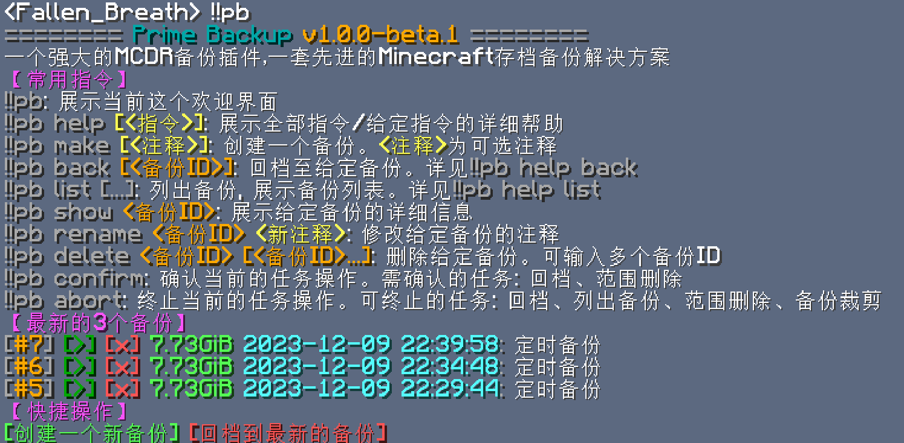

## 安装

### 准备 MCDR

Prime Backup 是一个 [MCDReforged](https://github.com/Fallen-Breath/MCDReforged) 插件，
它需要 `mcdreforged>=2.12` 才能运行

要安装/更新 MCDReforged，你可以运行：

```bash
pip3 install mcdreforged>=2.12 -U
```

详见 MCDR 的[相关文档](https://mcdreforged.readthedocs.io/en/latest/quick_start.html)

### 安装 Python 依赖

Prime Backup 需要一些 python 库才能运行，它们都被列在了
[GitHub 仓库](https://github.com/TISUnion/PrimeBackup) 根目录的 [requirements.txt](https://github.com/TISUnion/PrimeBackup/blob/master/requirements.txt) 文件中

```bash title="requirements.txt"
--8<-- "requirements.txt"
```

使用命令 `pip3 install -r requirements.txt` 即可安装所有需要的 Python 依赖

### 安装插件

从 [GitHub Release](https://github.com/TISUnion/PrimeBackup/releases) 下载 Prime Backup 插件，
并将其放入 MCDR 的插件文件夹中，然后执行 [MCDR 插件重载](https://mcdreforged.readthedocs.io/zh-cn/latest/command.html#hot-reloads) 操作

## 配置

在使用 Prime Backup 之前，你需要正确配置其配置文件，才可让其工作

别着急，对于大多数配置选项，你可以使用默认值。
但还有一些选项，是需要你配置一下的

### 位置

在 Prime Backup 插件首次被 MCDR 加载时，其配置文件将自动生成，
路径为：`config/prime_backup/config.json`

```bash
mcdr_root/
└── config/
    └── prime_backup/
        └── config.json       <-------------
```

它是一个 json 文件，所以你得遵循 json 语法来编辑

### 必要的配置项

配置文件中的一些重要内容如下所示：

1. 你想要使用的备份格式

    ```js
    // 根配置
    {
        // ...
        "backup": {
            "hash_method": "xxh128",
            "compress_method": "zstd",
        }
        // ...
    }
    ```
   
    - [`hash_method`](config.zh.md#hash_method): 对文件进行哈希的算法。可用选项： "xxh128", "sha256"

        - [`"xxh128"`](https://github.com/Cyan4973/xxHash):：一种极快的、高质量的 128 位哈希算法，不提供密码学安全性。
          推荐使用，除非你想要理论上的极端安全
        - [`"sha256"`](https://en.wikipedia.org/wiki/SHA-2): 一种广泛使用的、密码学安全的 256 位哈希算法。
          它比 xxh128 慢，但在现代的硬件上也不会慢太多

    - [`compress_method`](config.zh.md#compress_method): 备份文件的压缩方式。常用建议：

        - `"plain"`: 无压缩。如果你希望获得最快的操作速度，就用这个
        - [`"zstd"`](https://github.com/facebook/zstd): 快速且高效的压缩算法。如果你想节约一些磁盘空间的话，推荐使用
    
    !!! danger
    
        你 **不能** 在启用插件后修改 `hash_method`。请明智地做出选择
    
    !!! warning

        更改 `compress_method` 只会影响新备份中的新文件

2. 启用插件。在配置文件的根对象中，设置 `enabled` 为 `true`。它应该位于整个配置文件的最上面

    ```json
    // root config
    {
        "enabled": true
        // ...
    }
    ```

3. 使用 MCDR 命令重载插件

    ```text
    !!MCDR plugin reload prime_backup
    ```

现在 Prime Backup 应该开始工作了

## 使用

在 MCDR 控制台或游戏中输入 `!!pb`，你应该看到如下所示的欢迎页面


